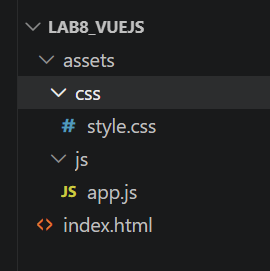
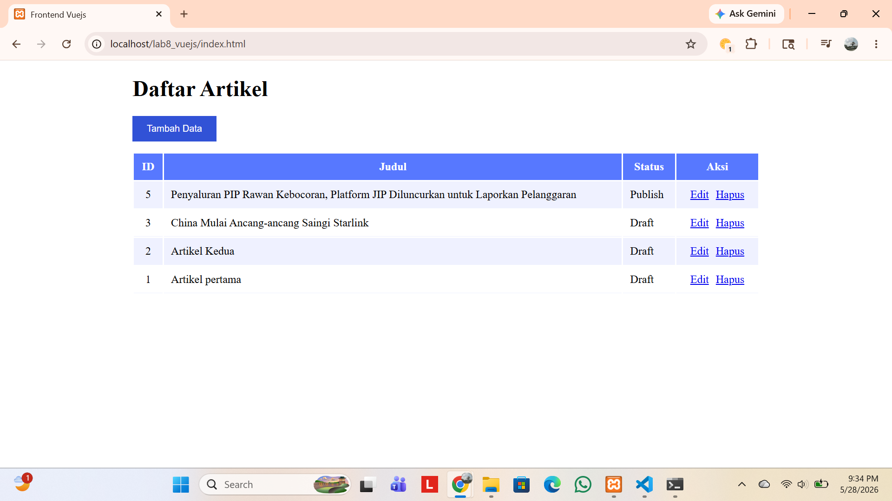
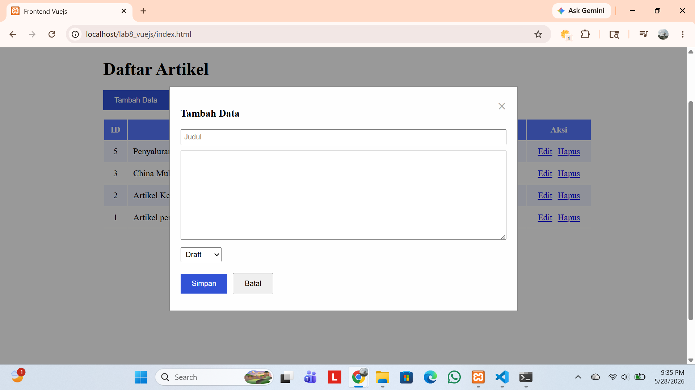

# Nama: Bagus aditya hermawan
# Nim: 312410382
# Kelas: I241C
# Matkul: Pemrograman Web 2

## Langkah-Langkah Praktikum 11: VueJS
VueJS merupakan sebuah framework JavaScript yang dirancang khusus untuk membangun antarmuka pengguna (UI) website yang interaktif dan dinamis. VueJS dapat digunakan untuk membangun aplikasi berbasis user interface, seperti halaman web, aplikasi mobile, dan aplikasi desktop.
Framework ini menawarkan keseimbangan dan kemudahan penggunaan dan performa yang kuat. 

Langkah-langkah sebagai berikut:
Menyiapkan library Vuejs dan Axios untuk call API REST. Menggunakan CDN untuk memuat library Vue.
```<script src="https://unpkg.com/vue@3/dist/vue.global.js"></script>```.
```<script src="https://unpkg.com/axios/dist/axios.min.js"></script>```

Struktur direktori:
##### .

Menampilkan data dengan membuat file index.html pada direktori lab8_vuejs. kode sebagai berikut:
```html
<!DOCTYPE html>
<html lang="en">
<head>
    <meta charset="UTF-8">
    <meta name="viewport" content="width=device-width, initial-scale=1.0">
    <title>Frontend Vuejs</title>
    <script src="https://unpkg.com/vue@3/dist/vue.global.js"></script>
    <script src="https://unpkg.com/axios/dist/axios.min.js"></script>
    <link rel="stylesheet" href="assets/css/style.css">
</head>
<body>
    <div id="app">
        <h1>Daftar Artikel</h1>

        <table>
            <thead>
                <tr>
                    <th>ID</th>
                    <th>Judul</th>
                    <th>Status</th>
                    <th>Aksi</th>
                </tr>
            </thead>
            <tbody>
                <tr v-for="(row, index) in artikel">
                    <td class="center-text">{{ row.id }}</td>
                    <td>{{ row.judul }}</td>
                    <td>{{ statusText(row.status) }}</td>
                    <td class="center-text">
                        <a href="#" @click="edit(row)">Edit</a>
                        <a href="#" @click="hapus(index, row.id)">Hapus</a>
                    </td>
                </tr>
            </tbody>
        </table>
    </div>
    <script src="assets/js/app.js"></script>
</body>
</html>
```
View ini akan menampilkan data artikel yg ada di ci4.

Membuat file app.js.
kode:
```JavaScript
const { createApp } = Vue

// tentukan lokasi API REST End Point
const apiUrl = 'http://localhost/lab11_ci/ci4/public'

createApp({

    data() {

        return {

            artikel: [],

            formData: {
                id: null,
                judul: '',
                isi: '',
                status: 0
            },

            showForm: false,

            formTitle: 'Tambah Data',

            statusOptions: [
                { text: 'Draft', value: 0 },
                { text: 'Publish', value: 1 }
            ]
        }
    },

    mounted() {
        this.loadData()
    },

    methods: {

        // Load data artikel
        loadData() {

            axios.get(apiUrl + '/post')

            .then(response => {
                this.artikel = response.data.artikel
            })

            .catch(error => {
                console.log(error)
            })
        },

        // Tambah data
        tambah() {

            this.showForm = true

            this.formTitle = 'Tambah Data'

            this.formData = {
                id: null,
                judul: '',
                isi: '',
                status: 0
            }
        },

        // Edit data
        edit(data) {

            this.showForm = true

            this.formTitle = 'Ubah Data'

            this.formData = {
                id: data.id,
                judul: data.judul,
                isi: data.isi,
                status: data.status
            }
        },

        // Hapus data
        hapus(index, id) {

            if (confirm('Yakin menghapus data?')) {

                axios.delete(apiUrl + '/post/' + id)

                .then(response => {
                    this.artikel.splice(index, 1)
                })

                .catch(error => {
                    console.log(error)
                })
            }
        },

        // Simpan data
        saveData() {

            // UPDATE
            if (this.formData.id) {

                axios.put(
                    apiUrl + '/post/' + this.formData.id,
                    this.formData
                )

                .then(response => {
                    this.loadData()
                })

                .catch(error => {
                    console.log(error)
                })

            }

            // INSERT
            else {

                axios.post(
                    apiUrl + '/post',
                    this.formData
                )

                .then(response => {
                    this.loadData()
                })

                .catch(error => {
                    console.log(error)
                })
            }

            // Reset form
            this.formData = {
                id: null,
                judul: '',
                isi: '',
                status: 0
            }

            this.showForm = false
        },

        // Status artikel
        statusText(status) {

            if (!status) {
                return 'Draft'
            }

            return status == 1
                ? 'Publish'
                : 'Draft'
        }
    }

}).mount('#app')
```
Fungsinya: 
- loadData
- CREATE Data
- UPDATE Data
- DELETE Data

Menambahkan form tambah dan ubah data pada file index.html dengan kode sebagai berikut:
```html
<button id="btn-tambah" @click="tambah">Tambah Data</button>
            <div class="modal" v-if="showForm">
                <div class="modal-content">
                    <span class="close" @click="showForm = false">&times;</span>
                    <form id="form-data" @submit.prevent="saveData">
                        <h3 id="form-title">{{ formTitle }}</h3>
                        <div><input type="text" name="judul" id="judul" vmodel="formData.judul" placeholder="Judul" required></div>
                        <div><textarea name="isi" id="isi" rows="10" vmodel="formData.isi"></textarea></div>
                        <div>
                            <select name="status" id="status" vmodel="formData.status">
                                <option v-for="option in statusOptions" :value="option.value">
                                    
                                    {{ option.text }}
                                </option>
                            </select>
                        </div>
                        <input type="hidden" id="id" v-model="formData.id">
                        <button type="submit" id="btnSimpan">Simpan</button>
                        <button @click="showForm = false">Batal</button>
                    </form>
                </div>
             </div>
```
Fungsinya: agar pengguna dapat menambahkan data artikel baru dan dapat mengubah artikelnya ketika ada kesalahan saat input.

Membuat file style.css agar halaman web terlihat menarik. kode sebagai berikut:
```css
#app {
    margin: 0 auto;
    width: 900px;
}

table {
    min-width: 700px;
    width: 100%;
}

th {
    padding: 10px;
    background: #5778ff;
    color: #ffffff;
}

tr td {
    border-bottom: 1px solid #eff1ff;
}

tr:nth-child(odd) {
    background-color: #eff1ff;
}

td {
    padding: 10px;
}

.center-text {
    text-align: center;
}

td a {
    margin: 5px;
}

#form-data {
    width: 600px;
}

form input {
    width: 100%;
    margin-bottom: 5px;
    padding: 5px;
    box-sizing: border-box;
}

form select {
    margin-bottom: 5px;
    padding: 5px;
    box-sizing: border-box;
}

form textarea {
    width: 100%;
    margin-bottom: 5px;
    padding: 5px;
    box-sizing: border-box;
}

form div {
    margin-bottom: 5px;
    position: relative;
}

form button {
    padding: 10px 20px;
    margin-top: 10px;
    margin-bottom: 10px;
    margin-right: 10px;
    cursor: pointer;
}

#btn-tambah {
    margin-bottom: 15px;
    padding: 10px 20px;
    cursor: pointer;
    background-color: #3152d6;
    color: #ffffff;
    border: 1px solid #3152d6;
}

#btnSimpan {
    background-color: #3152d6;
    color: #ffffff;
    border: 1px solid #3152d6;
}

.modal {
    display: block;
    position: fixed;
    z-index: 1;
    left: 0;
    top: 0;
    width: 100%;
    height: 100%;
    overflow: auto;
    background-color: rgba(0, 0, 0, 0.4);
}

.modal-content {
    background-color: #fefefe;
    margin: 15% auto;
    padding: 20px;
    border: 1px solid #888;
    width: 600px;
}

.close {
    color: #aaa;
    float: right;
    font-size: 28px;
    font-weight: bold;
    cursor: pointer;
}
```

Hasil:
##### .
##### .

Penggunaan VueJS mempermudah pembuatan antarmuka Frontend API untuk operasi CRUD secara dinamis. Melalui fitur reaktivitas data dan pengikatan formulir otomatis yang dapat langsung memperbarui tampilan tabel secara real-time tanpa perlu memuat ulang (reload) halaman web.
