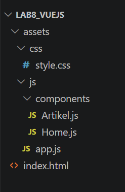
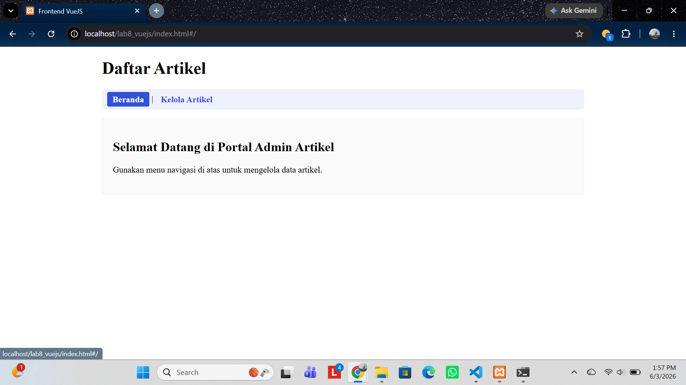
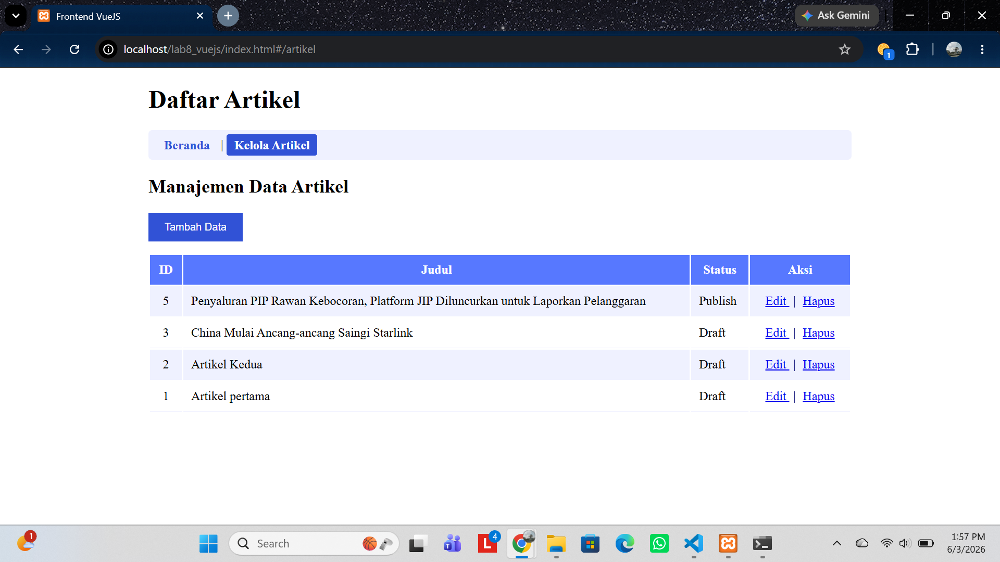
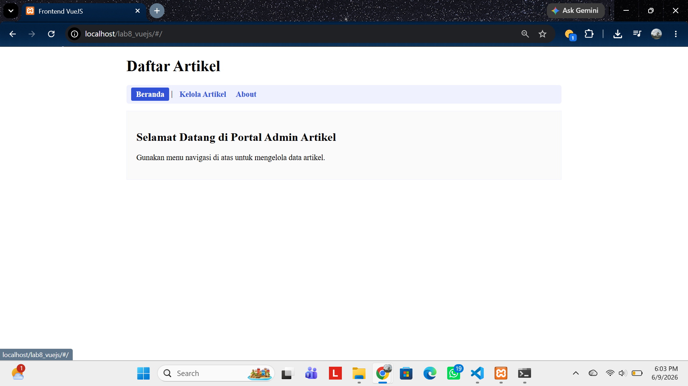
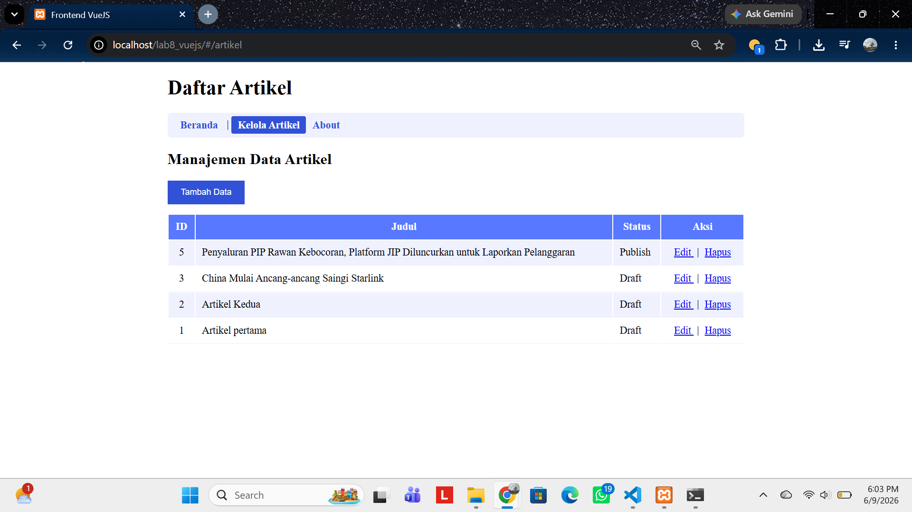
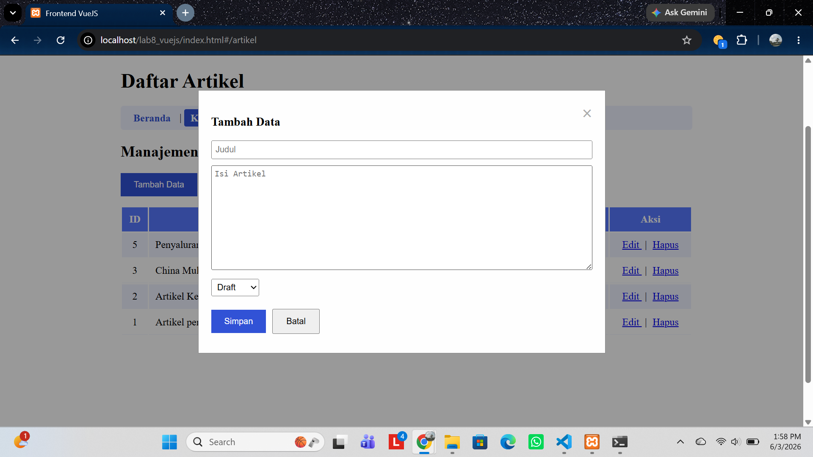
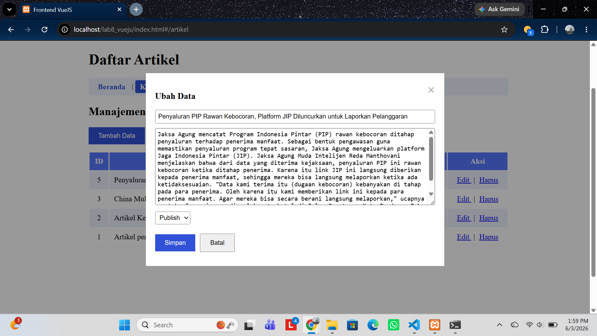
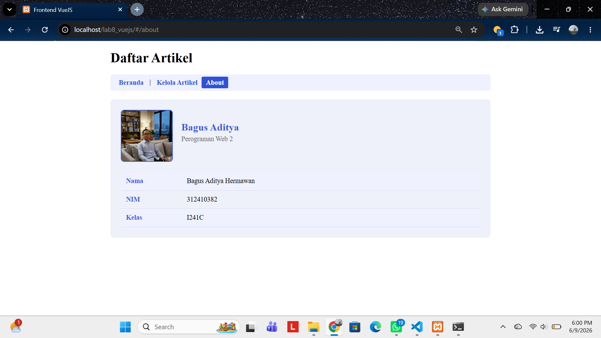

# Nama: Bagus aditya hermawan
# Nim: 312410382
# Kelas: I241C
# Matkul: Pemrograman Web 2

## Langkah-Langkah Praktikum 11: VueJS
VueJS merupakan sebuah framework JavaScript yang dirancang khusus untuk membangun antarmuka pengguna (UI) website yang interaktif dan dinamis. VueJS dapat digunakan untuk membangun aplikasi berbasis user interface, seperti halaman web, aplikasi mobile, dan aplikasi desktop.
Framework ini menawarkan keseimbangan dan kemudahan penggunaan dan performa yang kuat. 

Langkah-langkah sebagai berikut:
Menyiapkan library Vuejs dan Axios untuk call API REST. Menggunakan CDN untuk memuat library Vue.
```<script src="https://unpkg.com/vue@3/dist/vue.global.js"></script>```.
```<script src="https://unpkg.com/axios/dist/axios.min.js"></script>```

Struktur direktori:
##### .

Menampilkan data dengan membuat file index.html pada direktori lab8_vuejs. kode sebagai berikut:
```html
<!DOCTYPE html>
<html lang="en">
<head>
    <meta charset="UTF-8">
    <meta name="viewport" content="width=device-width, initial-scale=1.0">
    <title>Frontend Vuejs</title>
    <script src="https://unpkg.com/vue@3/dist/vue.global.js"></script>
    <script src="https://unpkg.com/axios/dist/axios.min.js"></script>
    <link rel="stylesheet" href="assets/css/style.css">
</head>
<body>
    <div id="app">
        <h1>Daftar Artikel</h1>

        <table>
            <thead>
                <tr>
                    <th>ID</th>
                    <th>Judul</th>
                    <th>Status</th>
                    <th>Aksi</th>
                </tr>
            </thead>
            <tbody>
                <tr v-for="(row, index) in artikel">
                    <td class="center-text">{{ row.id }}</td>
                    <td>{{ row.judul }}</td>
                    <td>{{ statusText(row.status) }}</td>
                    <td class="center-text">
                        <a href="#" @click="edit(row)">Edit</a>
                        <a href="#" @click="hapus(index, row.id)">Hapus</a>
                    </td>
                </tr>
            </tbody>
        </table>
    </div>
    <script src="assets/js/app.js"></script>
</body>
</html>
```
Penjelasan: View ini akan menampilkan data artikel yg ada di praktikum sebelumnya, yakni ci4.

Membuat file app.js.
kode:
```JavaScript
const { createApp } = Vue

// tentukan lokasi API REST End Point
const apiUrl = 'http://localhost/lab11_ci/ci4/public'

createApp({

    data() {

        return {

            artikel: [],

            formData: {
                id: null,
                judul: '',
                isi: '',
                status: 0
            },

            showForm: false,

            formTitle: 'Tambah Data',

            statusOptions: [
                { text: 'Draft', value: 0 },
                { text: 'Publish', value: 1 }
            ]
        }
    },

    mounted() {
        this.loadData()
    },

    methods: {

        // Load data artikel
        loadData() {

            axios.get(apiUrl + '/post')

            .then(response => {
                this.artikel = response.data.artikel
            })

            .catch(error => {
                console.log(error)
            })
        },

        // Tambah data
        tambah() {

            this.showForm = true

            this.formTitle = 'Tambah Data'

            this.formData = {
                id: null,
                judul: '',
                isi: '',
                status: 0
            }
        },

        // Edit data
        edit(data) {

            this.showForm = true

            this.formTitle = 'Ubah Data'

            this.formData = {
                id: data.id,
                judul: data.judul,
                isi: data.isi,
                status: data.status
            }
        },

        // Hapus data
        hapus(index, id) {

            if (confirm('Yakin menghapus data?')) {

                axios.delete(apiUrl + '/post/' + id)

                .then(response => {
                    this.artikel.splice(index, 1)
                })

                .catch(error => {
                    console.log(error)
                })
            }
        },

        // Simpan data
        saveData() {

            // UPDATE
            if (this.formData.id) {

                axios.put(
                    apiUrl + '/post/' + this.formData.id,
                    this.formData
                )

                .then(response => {
                    this.loadData()
                })

                .catch(error => {
                    console.log(error)
                })

            }

            // INSERT
            else {

                axios.post(
                    apiUrl + '/post',
                    this.formData
                )

                .then(response => {
                    this.loadData()
                })

                .catch(error => {
                    console.log(error)
                })
            }

            // Reset form
            this.formData = {
                id: null,
                judul: '',
                isi: '',
                status: 0
            }

            this.showForm = false
        },

        // Status artikel
        statusText(status) {

            if (!status) {
                return 'Draft'
            }

            return status == 1
                ? 'Publish'
                : 'Draft'
        }
    }

}).mount('#app')
```
Fungsinya: 
- loadData
- CREATE Data
- UPDATE Data
- DELETE Data

Menambahkan form tambah dan ubah data pada file index.html dengan kode sebagai berikut:
```html
<button id="btn-tambah" @click="tambah">Tambah Data</button>
            <div class="modal" v-if="showForm">
                <div class="modal-content">
                    <span class="close" @click="showForm = false">&times;</span>
                    <form id="form-data" @submit.prevent="saveData">
                        <h3 id="form-title">{{ formTitle }}</h3>
                        <div><input type="text" name="judul" id="judul" vmodel="formData.judul" placeholder="Judul" required></div>
                        <div><textarea name="isi" id="isi" rows="10" vmodel="formData.isi"></textarea></div>
                        <div>
                            <select name="status" id="status" vmodel="formData.status">
                                <option v-for="option in statusOptions" :value="option.value">
                                    
                                    {{ option.text }}
                                </option>
                            </select>
                        </div>
                        <input type="hidden" id="id" v-model="formData.id">
                        <button type="submit" id="btnSimpan">Simpan</button>
                        <button @click="showForm = false">Batal</button>
                    </form>
                </div>
             </div>
```
Fungsinya: agar pengguna dapat menambahkan data artikel baru dan dapat mengubah artikelnya ketika ada kesalahan saat input.

Membuat file style.css agar halaman web terlihat menarik. kode sebagai berikut:
```css
#app {
    margin: 0 auto;
    width: 900px;
}

table {
    min-width: 700px;
    width: 100%;
}

th {
    padding: 10px;
    background: #5778ff;
    color: #ffffff;
}

tr td {
    border-bottom: 1px solid #eff1ff;
}

tr:nth-child(odd) {
    background-color: #eff1ff;
}

td {
    padding: 10px;
}

.center-text {
    text-align: center;
}

td a {
    margin: 5px;
}

#form-data {
    width: 600px;
}

form input {
    width: 100%;
    margin-bottom: 5px;
    padding: 5px;
    box-sizing: border-box;
}

form select {
    margin-bottom: 5px;
    padding: 5px;
    box-sizing: border-box;
}

form textarea {
    width: 100%;
    margin-bottom: 5px;
    padding: 5px;
    box-sizing: border-box;
}

form div {
    margin-bottom: 5px;
    position: relative;
}

form button {
    padding: 10px 20px;
    margin-top: 10px;
    margin-bottom: 10px;
    margin-right: 10px;
    cursor: pointer;
}

#btn-tambah {
    margin-bottom: 15px;
    padding: 10px 20px;
    cursor: pointer;
    background-color: #3152d6;
    color: #ffffff;
    border: 1px solid #3152d6;
}

#btnSimpan {
    background-color: #3152d6;
    color: #ffffff;
    border: 1px solid #3152d6;
}

.modal {
    display: block;
    position: fixed;
    z-index: 1;
    left: 0;
    top: 0;
    width: 100%;
    height: 100%;
    overflow: auto;
    background-color: rgba(0, 0, 0, 0.4);
}

.modal-content {
    background-color: #fefefe;
    margin: 15% auto;
    padding: 20px;
    border: 1px solid #888;
    width: 600px;
}

.close {
    color: #aaa;
    float: right;
    font-size: 28px;
    font-weight: bold;
    cursor: pointer;
}
```

Aktifkan xampp terliebih dahulu. Lalu, jalankan dibrowser untuk melihat hasilnya.
Hasil:
##### .
##### .

Penggunaan VueJS mempermudah pembuatan antarmuka Frontend API untuk operasi CRUD secara dinamis. Melalui fitur reaktivitas data dan pengikatan formulir otomatis yang dapat langsung memperbarui tampilan tabel secara real-time tanpa perlu memuat ulang (reload) halaman web.

Pertanyaan dan Tugas
Selesaikan programnya sesuai Langkah-langkah yang ada. Anda boleh melakukan
improvisasi.


## Langkah-Langkah Praktikum 12: VueJS Komponrn dan Routing (Single page Application)
Vue Components merupakan bagian antarmuka pengguna (UI) yang bersifat modular dan dapat digunakan kembali. Dengan memanfaatkan komponen, tampilan aplikasi dapat dipecah menjadi beberapa bagian yang terpisah, seperti Header, Footer, Sidebar, maupun daftar data tertentu. Pendekatan ini membantu menjaga struktur kode tetap rapi, mudah dipelihara, dan lebih terorganisir.
Vue Router adalah library resmi untuk VueJS yang menangani pemindahan halaman di sisi
klien (Client-Side Routing). 

Langkah-Langkah Praktikum
Menambahkan pustaka Vue Router menggunakan CDN. lalu, menambahkan library Vue Router setelah VueJS dan Axios.

```<script src="https://unpkg.com/vue-router@4/dist/vue-router.global.js"></script>```.

Penjelasan: digunakan untuk menghubungkan library Vue Router ke dalam aplikasi Vue.js melalui CDN. dapat menghubungkan komponen ke rute tertentu dan dapat berpindah halaman tanpa harus direfresh.

Membuat folder components pada folder assets/js.
##### .

#### 1. Membuat File Komponen Halaman Utama
Membuat file Home.js pada folder assets/js/components.
kode sebagai berikut:
```JS
const Home = {
    template: `
         <div class="home-container">
         <h2>Selamat Datang di Portal Admin Artikel</h2>
         <p>Gunakan menu navigasi di atas untuk mengelola data artikel secara real-time
memanfaatkan RESTful API CodeIgniter 4 dan VueJS.</p>
         </div>
     `
};
```
Penjelasan: kode ini berguna sebagai tampilan halaman utama atau Home yang berisi sambutan dan menu navigasi untuk mengatur data artikel secara real-time yang dihubungkan menggunakan Vue Router.

#### 2.  Memindahkan Kode Fitur Artikel Ke Komponen (assets/js/components/Artikel.js)
Memindahkan logika CRUD artikel dari file app.js ke dalam file baru yakni Artikel.js.
```JS
const Artikel = {
    template: `
    <div>

        <h2>Manajemen Data Artikel</h2>

        <button id="btn-tambah" @click="tambah">
            Tambah Data
        </button>

        <div class="modal" v-if="showForm">
            <div class="modal-content">

                <span class="close" @click="showForm = false">
                    &times;
                </span>

                <form id="form-data" @submit.prevent="saveData">

                    <h3>{{ formTitle }}</h3>

                    <div>
                        <input
                            type="text"
                            name="judul"
                            v-model="formData.judul"
                            placeholder="Judul"
                            required
                        >
                    </div>

                    <div>
                        <textarea
                            name="isi"
                            rows="10"
                            v-model="formData.isi"
                            placeholder="Isi Artikel"
                            required
                        ></textarea>
                    </div>

                    <div>
                        <select
                            name="status"
                            v-model="formData.status"
                        >
                            <option
                                v-for="option in statusOptions"
                                :key="option.value"
                                :value="option.value"
                            >
                                {{ option.text }}
                            </option>
                        </select>
                    </div>

                    <input
                        type="hidden"
                        v-model="formData.id"
                    >

                    <button
                        type="submit"
                        id="btnSimpan"
                    >
                        Simpan
                    </button>

                    <button
                        type="button"
                        @click="showForm = false"
                    >
                        Batal
                    </button>

                </form>

            </div>
        </div>

        <table>
            <thead>
                <tr>
                    <th>ID</th>
                    <th>Judul</th>
                    <th>Status</th>
                    <th>Aksi</th>
                </tr>
            </thead>

            <tbody>
                <tr
                    v-for="(row, index) in artikel"
                    :key="row.id"
                >
                    <td class="center-text">
                        {{ row.id }}
                    </td>

                    <td>
                        {{ row.judul }}
                    </td>

                    <td>
                        {{ statusText(row.status) }}
                    </td>

                    <td class="center-text">
                        <a
                            href="#"
                            @click.prevent="edit(row)"
                        >
                            Edit
                        </a>

                        |

                        <a
                            href="#"
                            @click.prevent="hapus(index, row.id)"
                        >
                            Hapus
                        </a>
                    </td>
                </tr>
            </tbody>
        </table>

    </div>
    `,

    data() {
        return {
            artikel: [],

            formData: {
                id: null,
                judul: '',
                isi: '',
                status: 0
            },

            showForm: false,

            formTitle: 'Tambah Data',

            statusOptions: [
                {
                    text: 'Draft',
                    value: 0
                },
                {
                    text: 'Publish',
                    value: 1
                }
            ]
        };
    },

    mounted() {
        this.loadData();
    },

    methods: {

        // Load Data
        loadData() {

            axios.get(apiUrl + '/post')

                .then(response => {
                    this.artikel = response.data.artikel;
                })

                .catch(error => {
                    console.log(error);
                });
        },

        // Tambah Data
        tambah() {

            this.showForm = true;

            this.formTitle = 'Tambah Data';

            this.formData = {
                id: null,
                judul: '',
                isi: '',
                status: 0
            };
        },

        // Edit Data
        edit(data) {

            this.showForm = true;

            this.formTitle = 'Ubah Data';

            this.formData = {
                id: data.id,
                judul: data.judul,
                isi: data.isi,
                status: data.status
            };
        },

        // Hapus Data
        hapus(index, id) {

            if (confirm('Yakin menghapus data?')) {

                axios.delete(apiUrl + '/post/' + id)

                    .then(response => {
                        this.artikel.splice(index, 1);
                    })

                    .catch(error => {
                        console.log(error);
                    });
            }
        },

        // Simpan Data
        saveData() {

            // UPDATE
            if (this.formData.id) {

                axios.put(
                    apiUrl + '/post/' + this.formData.id,
                    this.formData
                )

                .then(response => {
                    this.loadData();
                })

                .catch(error => {
                    console.log(error);
                });

            }

            // INSERT
            else {

                axios.post(
                    apiUrl + '/post',
                    this.formData
                )

                .then(response => {
                    this.loadData();
                })

                .catch(error => {
                    console.log(error);
                });
            }

            // Reset Form
            this.formData = {
                id: null,
                judul: '',
                isi: '',
                status: 0
            };

            this.showForm = false;
        },

        // Status Artikel
        statusText(status) {

            if (!status) {
                return 'Draft';
            }

            return status == 1
                ? 'Publish'
                : 'Draft';
        }
    }
};
```
Penjelasan: kode ini berguna untuk perintah CRUD Logika CRUD. Logika ini sebelumnya berada di app.js. lalu, dipindahkan ke artikel.js agar kode lebih terstruktur dan mudah dikelola. File app.js nantinya berguna untuk konfigurasi aplikasi dan routing, sedangkan artikel.js menangani fungsi tambah, tampil, ubah, dan hapus data artikel melalui API.

#### 3. Mengonfigurasi Vue Router pada assets/js/app.js
Mengedit kode di file app.js untuk mendaftarkan rute internal, komponen, dan melakukan mounting aplikasi.
```JS
const { createApp } = Vue;
const { createRouter, createWebHashHistory } = VueRouter;

// endpoint API
const apiUrl = 'http://localhost/lab11_ci/ci4/public';

// routes
const routes = [
    {
        path: '/',
        component: Home
    },
    {
        path: '/artikel',
        component: Artikel
    },
    {
        path: '/about',
        component: About
    }
];

// router
const router = createRouter({
    history: createWebHashHistory(),
    routes
});

// app
const app = createApp({});

app.use(router);

app.mount('#app');
```
Penjelasan: Kode tersebut digunakan untuk mengatur navigasi halaman menggunakan Vue Router. Selain itu, kode ini juga mendefinisikan endpoint API, membuat rute untuk halaman Home, Artikel, dan About yang dikonfigurasi menggunakan Hash History agar navigasi antarhalaman dapat berjalan tanpa memuat ulang halaman. lalu menjalankan aplikasi pada elemen HTML dengan id app.

#### 4. Memodifikasi Master Layout pada index.html
Menyesuaikan kode agar menyediakan menu navigasi menggunakan <router-link> dan tempat penampung halaman dinamis menggunakan <router-view>.
```JS
<!DOCTYPE html>
<html lang="en">
<head>
    <meta charset="UTF-8">
    <meta name="viewport" content="width=device-width, initial-scale=1.0">
    <title>Frontend VueJS</title>

    <script src="https://unpkg.com/vue@3/dist/vue.global.js"></script>
    <script src="https://unpkg.com/axios/dist/axios.min.js"></script>
    <script src="https://unpkg.com/vue-router@4/dist/vue-router.global.js"></script>

    <link rel="stylesheet" href="assets/css/style.css">
</head>
<body>

    <div id="app">
        <header>
            <h1>Daftar Artikel</h1>

            <nav class="nav-menu">
                <router-link to="/">Beranda</router-link> |
                <router-link to="/artikel">Kelola Artikel</router-link>
                <router-link to="/about">About</router-link>
            </nav>
        </header>

        <main>
            <router-view></router-view>
        </main>
    </div>

    <!-- Components -->
    <script src="assets/js/components/Home.js"></script>
    <script src="assets/js/components/Artikel.js"></script>
    <script src="assets/js/components/About.js"></script>

    <!-- Main App -->
    <script src="assets/js/app.js"></script>

</body>
</html>
```
Penjelasan: Menu navigasi seperti halaman Beranda, Kelola Artikel, dan About menggunakan router-link, sedangkan router-view berfungsi menampilkan halaman komponen sesuai rute yang dipilih.

#### 5. Tambahan CSS Menarik pada assets/css/style.css
Agar tampilan menu terlihat rapi dan menarik.
```css
.nav-menu {
 padding: 10px;
 background: #eff1ff;
 border-radius: 5px;
 margin-bottom: 15px;
}
.nav-menu a {
 text-decoration: none;
 color: #3152d6;
 font-weight: bold;
 padding: 5px 10px;
}
/* Style otomatis saat route aktif */
.router-link-exact-active {
 background-color: #3152d6;
 color: #ffffff !important;
 border-radius: 3px;
}
.home-container {
 padding: 20px;
 border: 1px solid #eff1ff;
 background: #fafafa;
}
```
Hasil:
##### .
##### .

Pertanyaan	dan	Tugas
1. Selesaikan semua langkah praktikum di atas.
2. Tambahkan satu rute baru (/about) beserta komponen About.js baru yang berisi profil singkat Anda (Nama, NIM, Kelas, dan Foto/Avatar). Masukkan tautan rutenya ke dalam menu navigasi atas pada index.html.
```html
<nav class="nav-menu">
                <router-link to="/">Beranda</router-link> |
                <router-link to="/artikel">Kelola Artikel</router-link>
                <router-link to="/about">About</router-link>
            </nav>
```
Penjelasan: Menu navigasi ditambahkan pada html supaya halaman about dan halaman terhubung.
```JS
const routes = [
    {
        path: '/',
        component: Home
    },
    {
        path: '/artikel',
        component: Artikel
    },
    {
        path: '/about',
        component: About
    }
];
```
Penjelasan: Menambahkan route agar dapat berpindah ke halaman about.

```JS
const About = {
    template: `
    <div class="about-container">

        <div class="profile-card">

            <div class="profile-header">
                

                <div class="profile-title">
                    <h2>Bagus Aditya</h2>
                    <p>Perograman Web 2</p>
                </div>
            </div>

            <div class="profile-info">
                <table>
                    <tr>
                        <td>Nama</td>
                        <td>Bagus Aditya Hermawan</td>
                    </tr>
                    <tr>
                        <td>NIM</td>
                        <td>312410382</td>
                    </tr>
                    <tr>
                        <td>Kelas</td>
                        <td>I241C</td>
                    </tr>
                </table>
            </div>

        </div>

    </div>
    `
};
```
Penjelasan: halaman about ini berisikan profil: Nama, NIM, Kelas, dan Foto/Avatar.

```css
.about-container {
    margin-top: 20px;
}

.profile-card {
    background: #eef0fa;
    border-radius: 8px;
    padding: 25px;
}

.profile-header {
    display: flex;
    align-items: center;
    gap: 20px;
    margin-bottom: 25px;
}

.profile-img {
    width: 120px;
    height: 120px;
    border-radius: 8px;
    object-fit: cover;
    border: 2px solid #3b5bdb;
}

.profile-title h2 {
    margin: 0;
    color: #3b5bdb;
}

.profile-title p {
    margin-top: 5px;
    color: #666;
}

.profile-info table {
    width: 100%;
    border-collapse: collapse;
}

.profile-info td {
    padding: 12px;
    border-bottom: 1px solid #d6daf0;
}

.profile-info td:first-child {
    font-weight: bold;
    width: 120px;
    color: #3b5bdb;
}
```
Penjelasan: agar tampilan halaman about lebih menarik.


3. Lakukan pengujian perpindahan halaman menu (Beranda, Kelola Artikel, dan About) dan pastikan browser tidak melakukan hard-reload (SPA bekerja).
##### .
##### .
Tambah artikel:
##### .
Edit artikel:
##### .
Halaman about:
##### .
